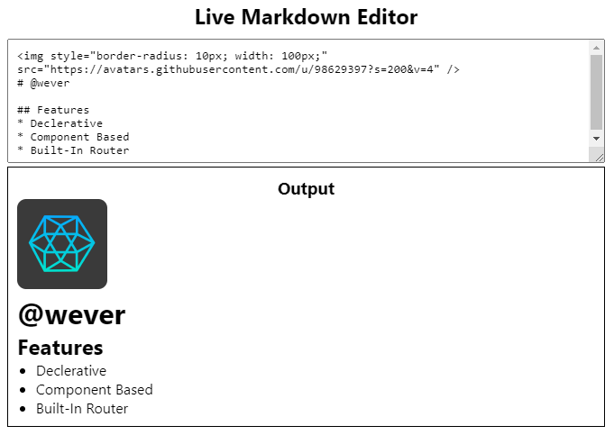

# [@WEVER](https://wever-org.github.io/)

XEON JS is an open-source JavaScript framework & library that helps you to create amazing User Interfaces. It makes developing web-applications easy, fast & painless. It allows you to create component view in your application and easily manage them. Writing both HTML & Javascript together without template litrals makes the application **_declarative_**, **_easier to manage_** and **_faster_**.

* **_Declarative:_** Write both HTML and Javascript together in a single Javascript file. Rather than using template literals, here you are allowed to use Javascript XML expression (JSX). Those JSX code are compiled by babel js and then converted into XEON XSET Object.

* **_Component Based:_** Create your own XEON Component to create and manage complicated User Interfaces. Those components are reusable and can be used in multiple places. You can also initialize a function executed only when the component is been mounted. Place a return statement in the function to be executed just before the component is un-mounted or re-rendered.

* **_Built-in Router:_** XEON JS comes with a built-in router that helps you to navigate between different pages. It's a very simple but powerfull router, including url parameters to make your application more dynamic. You can add Component for 404 error. If url does not match any of the configured path, then it will fallback to the "/404" path or "/" path.

## **_Example_**
```jsx
function App(props) {

	// Get xeon class from props. Works only here as you can't import them.
	const xeon = props.xeon;
	const Remarkable = props.Remarkable;
	var md = new Remarkable();

	// Create unique ids.
	const id = xeon.uuid(["input", "result"]);

	const handleChange = e => {
		var value = e.target.value;
		const result = document.getElementById(id.result);

		result.innerHTML = md.render(value);
	}

	// this function will execute only when the component is rendered.
	xeon.onInit(() => {
		document.getElementById(id.result).innerHTML = md.render(document.getElementById(id.input).value);
	});

	// Return JSX or XSET.
	return (
		<div style={{height: "100%" }}>
			<h2 style={{ textAlign: "center" }}>Live Markdown Editor</h2>
			<div style={{ padding: "10px" }}>
				<textarea
					style={{
						width: "100%",
						resize: "vertical",
						minHeight: "100px",
						maxHeight: "300px",
						padding: "10px"
					}}
					id={id.input}
					onKeyPress={handleChange}
					onChange={handleChange}
					onKeyUp={handleChange}
				># Hello</textarea>

				<div
					style={{
						width: "100%",
						border: "1px solid",
						padding: "10px"
					}}
				>
					<h3 style={{ textAlign: "center" }}>Output</h3>
					<div id={id.result}></div>
				</div>
			</div>
		</div>
	);
}
```
### The above code example simply render this.
